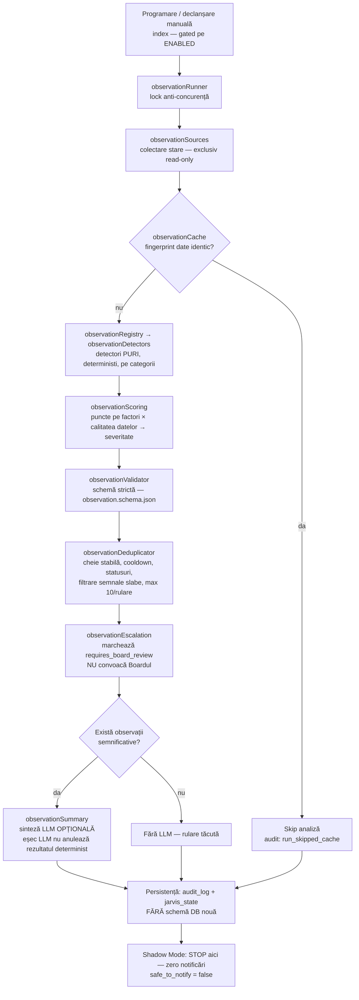

# OBSERVATION ENGINE — Arhitectură (Faza 4)

> **STARE: PROIECTAT — implementat GATED, flag implicit OFF, prima rulare exclusiv în Shadow Mode.**
> `OBSERVATION_ENGINE_ENABLED=false` · `OBSERVATION_ENGINE_SHADOW_MODE=true` · `OBSERVATION_NOTIFICATIONS_ENABLED=false` · `OBSERVATION_BOARD_ESCALATION_ENABLED=false`

> **Notă de numerotare:** acest capitol poartă indexul **21** deoarece indexul natural **06** este deja ocupat de `06-company-health` (Company Health Engine). Observation Engine este consumator al Health Score, nu înlocuitorul lui.

---

## 1. Ce este și ce NU este

Observation Engine este stratul **proactiv** al lui JARVIS: un motor care analizează periodic starea companiei PROFI CONCEPT / Bell Residence și detectează probleme, oportunități, contradicții și deviații **înainte** ca Adrian să întrebe.

Ciclul lui complet este: **observă → detectează → verifică → prioritizează → explică → marchează escaladarea către Executive Board → informează pe Adrian DOAR când există valoare reală.**

| Motorul ESTE | Motorul NU ESTE |
|---|---|
| Un observator determinist al stării companiei | Un decident — **NU ia decizii** |
| Un detector de probleme, oportunități, contradicții, deviații | Un executant — **NU execută acțiuni** |
| Un prioritizator (scoring determinist → severitate) | Un expeditor — **NU trimite emailuri, NU creează task-uri** |
| Un marcator de escaladare (`requires_board_review`) | Un convocator — **NU convoacă Executive Board în această etapă** |
| Un furnizor de context pentru Adrian și, ulterior, pentru Board | Un modificator de sisteme — **NU scrie în Operational, Gmail, Calendar** |

Reguli absolute:

- **approvalGate rămâne singura poartă pentru efecte.** Observation Engine nu are nicio cale ocolitoare către efecte în lumea reală.
- **Plățile sunt excluse total** din orice flux al motorului.
- Motorul **nu inventează date**: lipsa datelor bancare, de vânzări sau de trafic se declară explicit (`data_quality`, `unknowns`), nu se interpretează ca zero.
- Motorul **nu emite observații doar ca să demonstreze că rulează.** Fără observații semnificative → rulare tăcută, doar audit.

## 2. Trecerea: JARVIS reactiv → JARVIS proactiv

| Dimensiune | Până acum (reactiv) | Faza 4 (proactiv) |
|---|---|---|
| Declanșator | Întrebarea lui Adrian | Programare periodică (30–60 min / zilnic / săptămânal) |
| Acoperire | Doar ce s-a întrebat | 8 categorii scanate sistematic: cash, sales, traffic, projects, people, decisions, ops_risk, founder |
| Momentul detecției | După ce problema devine vizibilă | Înainte ca problema să fie întrebată |
| Memoria problemelor | Fragmentară, per conversație | Persistentă: `new / repeated / worsening / improving / resolved` |
| Riscul de zgomot | Scăzut (răspunde doar la cerere) | Controlat prin deduplicare, cooldown, prag de semnal, max 10/rulare |
| Efecte | Zero fără approvalGate | Neschimbat: zero fără approvalGate |

Trecerea schimbă **cine pune prima întrebare** — nu cine decide. Decizia rămâne la Adrian; recomandarea structurată rămâne, în etapa viitoare, la Executive Board.

## 3. Fluxul unei rulări

Pe scurt, ordinea canonică: **surse deterministe → detectori → scoring → validare → deduplicare → escaladare marcată → sinteză LLM opțională → audit + jarvis_state.** LLM-ul intervine o singură dată, la final, doar pentru formulare — niciodată pentru detecție, severitate sau prioritizare.

## 4. Harta reutilizării (NIMIC duplicat)

Observation Engine **nu recalculează nimic din ce există deja**. Este un strat de citire și corelare peste motoarele existente:

| Componentă existentă | Rol în Observation Engine | Mod de acces |
|---|---|---|
| `predictionState` | Starea curentă agregată a companiei — punctul de plecare al colectării | read-only |
| `predictionEngine` (`predict`) | Predicții existente, folosite ca semnal, nu regenerate | read-only |
| `riskEngine` (`assessRisks`) | Riscurile deja evaluate — evidență `[riskEngine]` | read-only |
| `cashForecast` (`buildForecast`) | Proiecția de cash și obligațiile — evidență `[cashForecast]` | read-only |
| `healthScore` (`computeHealth`) | Scorul de sănătate (capitolul 06) — baseline pentru deviații | read-only |
| `supervisor/detectors D1–D12` | Detectorii de supervizare existenți — semnale ops_risk reutilizate, nu rescrise | read-only |
| `memory/decisions` | Deciziile aprobate — baza categoriei `decisions` (contradicții, neexecutate) | read-only |
| `reminders` | Termene și amânări — semnal pentru cash/projects/people | read-only |
| `audit` (`audit_log`) | Istoric de rulări și erori — sursă pentru ops_risk; destinație pentru jurnalul motorului | citire + scriere jurnal |
| `state/jarvis_state` | Persistența stării de deduplicare și a observațiilor — **fără tabele noi** | citire + scriere chei proprii |
| `cache` (infrastructura existentă) | Suport pentru fingerprint-ul de date al `observationCache` | reutilizat |

Singurul lucru nou este **corelarea și memoria observațiilor** — nu sursele, nu calculele, nu schema bazei de date.

## 5. Cele 10 module din `src/observationEngine/`

| # | Modul | Responsabilitate |
|---|---|---|
| 1 | `index` | API-ul public al motorului + programarea rulărilor, integral gated pe flag-uri; punct unic de intrare |
| 2 | `observationSources` | Colectarea stării: predictionState, buildForecast, assessRisks, computeHealth, predict, reminders, decisions, audit_log (read-only), jarvis_state — exclusiv citire |
| 3 | `observationRegistry` + `observationDetectors` | Registrul detectorilor și detectorii **puri, deterministi**, organizați pe cele 8 categorii (cash, sales, traffic, projects, people, decisions, ops_risk, founder) |
| 4 | `observationScoring` | Scoring determinist pe factori (impact financiar, urgență, ireversibilitate, probabilitate, sisteme afectate, persistență, riscuri juridic/reputațional/operațional, dependență de fondator) × multiplicatorul calității datelor → severitate; LLM-ul nu inventează severitate |
| 5 | `observationValidator` | Impunerea schemei stricte a observației (`/codex/schemas/observation.schema.json`); nimic nevalid nu trece mai departe |
| 6 | `observationDeduplicator` | Cheie stabilă `categorie:tip:entitate`, cooldown pe severitate (critical 2h / high 6h / rest 24h), statusuri `new/repeated/worsening/improving/resolved`, filtrarea semnalelor slabe (<15, sub 3 rulări), grupare, max 10 observații/rulare |
| 7 | `observationCache` | Fingerprint pe datele de intrare — date identice nu se reanalizează (cost zero pe rulări fără schimbări) |
| 8 | `observationEscalation` | Marchează `requires_board_review` conform criteriilor; scrie motivul în audit; **NU convoacă Executive Board în această etapă** |
| 9 | `observationSummary` | Sinteza LLM — **doar** dacă există observații semnificative; eșecul LLM nu anulează rezultatul determinist |
| 10 | `observationRunner` | Orchestrarea unei rulări: lock anti-concurență, audit, persistență în jarvis_state — **fără schemă DB nouă** |

## 6. Modurile de funcționare

| Mod | Condiție | Comportament |
|---|---|---|
| **OFF** (implicit) | `OBSERVATION_ENGINE_ENABLED=false` | Motorul nu rulează deloc. Nicio programare activă, niciun consum. |
| **SHADOW** | `ENABLED=true` + `OBSERVATION_ENGINE_SHADOW_MODE=true` | Rulează complet, scrie **doar** în audit și jarvis_state. Zero notificări, `safe_to_notify=false` pe toate observațiile. Modul obligatoriu al primei rulări și al perioadei de validare. |
| **ACTIV** (etapă viitoare) | `ENABLED=true` + `SHADOW_MODE=false` + `OBSERVATION_NOTIFICATIONS_ENABLED=true` | Informează pe Adrian doar la valoare reală. Escaladarea efectivă către Board rămâne separat gated pe `OBSERVATION_BOARD_ESCALATION_ENABLED`. |

Trecerea între moduri este exclusiv o decizie a lui Adrian, prin flag-uri — niciodată o auto-promovare a motorului.

## 7. Programarea (Europe/Bucharest, doar când ENABLED=on)

| Rulare | Frecvență | Scop |
|---|---|---|
| **Rapidă** | la 30–60 min (`OBSERVATION_INTERVAL_MINUTES`, implicit **45**) | Semnale operaționale proaspete; cache-ul elimină rulările pe date neschimbate |
| **Zilnică aprofundată** | **06:45** | Analiza completă înaintea raportului de dimineață — raportul poate include observațiile zilei |
| **Săptămânală** | **luni 06:30** | Tendințe: agravări/ameliorări pe orizont de săptămâni, persistențe, pattern-uri |

## 8. Principiile de cost

1. **Determinist întâi.** Detecția, scoringul, severitatea, deduplicarea și escaladarea sunt 100% deterministe — cost LLM zero pe tot lanțul de analiză.
2. **LLM doar la observații semnificative.** `observationSummary` se apelează o singură dată per rulare și numai dacă există ceva de sintetizat. Rulările tăcute nu ating LLM-ul.
3. **Cache pe date identice.** Fingerprint-ul din `observationCache` face ca rulările rapide fără date noi să se încheie imediat.
4. **Lock anti-concurență.** `observationRunner` garantează o singură rulare simultană — fără analize duble, fără cost dublu.
5. **Timeout + fallback.** Orice apel extern (inclusiv LLM) are timeout; eșecul sintezei degradează elegant la rezultatul determinist, care se persistă oricum în audit + jarvis_state.

---

*Documentele-pereche ale acestui capitol detaliază categoriile de observații, schema canonică, scoringul, deduplicarea și criteriile de escaladare. Fluxul viitor complet — Observation Engine → Observation Validator → Executive Board → CEO Recommendation → Adrian — rămâne gated și aparține unei etape ulterioare.*
