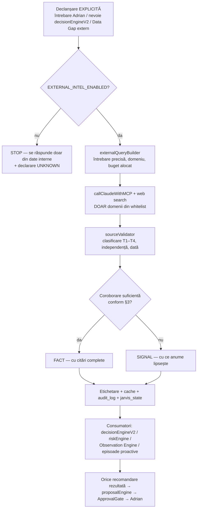

# EXTERNAL INTELLIGENCE — Monitorizare externă (arhitectură viitoare)

> **STARE: PROIECTAT — NEIMPLEMENTAT. Document de arhitectură pentru o fază viitoare.**
> **NU se activează browsing continuu în această fază.** Nicio rulare programată, niciun crawler, niciun feed live.
> Flag-uri propuse (toate implicit OFF): `EXTERNAL_INTEL_ENABLED=false` · `EXTERNAL_INTEL_SHADOW_MODE=true` · `EXTERNAL_INTEL_SCHEDULED=false` · `EXTERNAL_INTEL_NOTIFICATIONS_ENABLED=false`

> **Poziție în MASTER PHASE (CEO AI Operational Intelligence):** acest document acoperă jumătatea **SEE → UNDERSTAND → VERIFY** aplicată **lumii din afara companiei**. Tot ce vede JARVIS azi ([companyDataMap](./COMPANY_DATA_MAP.md), 22 de domenii) este intern. Un CEO care vede doar interiorul firmei conduce cu un ochi închis — dar un CEO care crede orice citește pe internet conduce cu ochii legați. Acest capitol definește cum se deschide al doilea ochi **fără** a introduce zgomot, cost necontrolat sau decizii bazate pe surse slabe.

---

## 1. Ce este și ce NU este

External Intelligence este stratul prin care CEO AI va percepe **contextul extern** al PROFI CONCEPT / Bell Residence: legislație, fiscalitate, piața construcțiilor, piața imobiliară Sibiu, dobânzi, finanțări, concurență, știri relevante. Este un **adaptor de percepție**, nu un motor de decizie.

| External Intelligence ESTE | External Intelligence NU ESTE |
|---|---|
| Un colector punctual de fapte externe, la cerere sau la rulări explicite | Un browser autonom care navighează liber pe internet |
| Un verificator de surse (whitelist + coroborare) | Un agregator de zvonuri sau un cititor de social media |
| Un separator strict FACT / SIGNAL / INTERPRETATION / RECOMMENDATION | Un generator de „adevăruri" din articole de presă |
| Un furnizor de context pentru motoarele existente (decision, risk, cash) | Un decident — **NU ia decizii**, ca orice alt strat JARVIS |
| Un consumator controlat al web search-ului deja existent în `callClaudeWithMCP` | O infrastructură nouă de scraping/crawling — **NU se construiește așa ceva** |
| Un centru de cost monitorizat (buget explicit per rulare/zi) | Un consum nelimitat de tokeni și căutări |

Reguli absolute (moștenite integral din [00-governance](../00-governance/) și din MASTER PHASE):

- **ZERO acțiuni autonome.** External Intelligence citește; nu trimite, nu publică, nu răspunde nimănui în exterior.
- **approvalGate rămâne singura poartă pentru efecte.** Inclusiv pentru orice viitoare abonare la surse plătite.
- **Plățile sunt excluse total.**
- **Date lipsă ≠ zero.** „Nu am găsit o sursă de încredere" se declară ca `UNKNOWN` + Data Gap ([dataGapEngine](./DATA_GAPS.md)), nu se umple cu presupuneri.
- **Decizie cu date critice lipsă ≠ recomandare finală.** Dacă un fapt extern critic nu e coroborat, [decisionEngineV2](./DECISION_ENGINE_V2.md) primește `DATA_REQUIRED`, nu o recomandare.

## 2. Domeniile externe monitorizate

Fiecare domeniu extern există doar pentru că **alimentează** unul sau mai multe domenii interne din registrul celor 22 ([companyDataMap](./COMPANY_DATA_MAP.md)). Un domeniu extern fără consumator intern nu se monitorizează — este zgomot prin definiție.

| Domeniu extern | Ce urmărește (exemple concrete) | Alimentează intern | Impact de business tipic |
|---|---|---|---|
| **LEGISLAȚIE** | Modificări Cod Civil / urbanism / autorizare construcții, legea 50/1991, recepții | LEGAL, PROJECTS, CONSTRUCTION | Blocaje autorizare, obligații noi la recepție/vânzare |
| **FISCALITATE** | TVA (cote, TVA redus locuințe), impozit pe profit/dividende, e-Factura, ANAF | ACCOUNTING, CASH, SALES | Preț final apartamente, marjă, obligații declarative |
| **CONSTRUCȚII** | Costuri materiale, indici INS construcții, normative tehnice, forță de muncă | CONSTRUCTION, SUPPLIERS, PROJECTS | Buget Corp 3, renegocieri furnizori, grafic execuție |
| **IMOBILIARE** | Prețuri/mp Sibiu, volum tranzacții, cerere pe segmente, chirii | SALES, BELL_INVENTORY, LEADS | Politica de preț 66.476 / 99.943 / 125.786 €, ritm vânzări |
| **DOBÂNZI** | BNR (rata de politică monetară), IRCC, ROBOR, condiții credite ipotecare | FINANCING, RECEIVABLES, SALES | Accesibilitatea creditului pentru clienți → viteza funnel-ului |
| **FINANȚĂRI** | Programe guvernamentale (tip Noua Casă), granturi, condiții bancare developeri | FINANCING, CASH | Surse alternative de lichiditate, argumente de vânzare |
| **PIAȚĂ** | Macro local Sibiu: demografie, salarii, investiții, infrastructură | SALES, MARKETING, PROJECTS | Dimensionarea proiectelor viitoare, mesaje de marketing |
| **CONCURENȚĂ** | Proiecte rezidențiale noi Sibiu, prețuri listate, stadii, oferte | SALES, MARKETING, BELL_INVENTORY | Poziționare, diferențiere, presiune pe preț |
| **ȘTIRI** | Evenimente punctuale relevante (bancare, dezvoltatori, autorități locale) | RISK (10-risk-engine), DECISIONS | Semnale timpurii de risc sau oportunitate |

Fiecare domeniu extern va purta aceleași atribute ca domeniile interne: `SOURCE / CONNECTED / FRESHNESS / QUALITY / WHAT CEO KNOWS / WHAT CEO DOES NOT KNOW / BUSINESS IMPACT`, cu stările `CONNECTED / PARTIAL / NOT_CONNECTED`. **Astăzi toate cele 9 domenii externe sunt `NOT_CONNECTED`** — și se declară ca atare, nu se simulează.

## 3. Regula de aur a surselor

> **NICIODATĂ o singură sursă slabă pentru o decizie materială.**

O decizie este **materială** dacă atinge oricare dintre: cash peste pragul din [companyConfig](./COMPANY_CONFIG.md), prețul de listă al unui apartament, un angajament contractual, o obligație legală/fiscală, sau structura unui proiect. Pentru orice altceva, un semnal necoroborat poate fi cel mult menționat — etichetat explicit ca semnal.

### 3.1 Ierarhia surselor

| Nivel | Tip | Exemple | Poate susține singură un FACT? |
|---|---|---|---|
| **T1 — Oficială** | Emitent primar | Monitorul Oficial, ANAF, BNR, INS, Primăria Sibiu, portal legislativ | **DA** (cu citarea actului/paginii) |
| **T2 — Profesională** | Instituțional secundar | Big4/consultanți fiscali publici, asociații profesionale, bănci (rapoarte oficiale) | DA, doar dacă citează sursa T1 verificabilă |
| **T3 — Presă de calitate** | Jurnalism economic | Publicații economice consacrate | **NU** — minim 2 surse T3 independente SAU 1×T3 + confirmare T1/T2 |
| **T4 — Slabă** | Restul | Bloguri, agregatoare, social media, forumuri, site-uri de anunțuri fără istoric | **NU, niciodată.** Cel mult generează un SIGNAL de investigat |

Reguli de coroborare:

- **FACT pentru decizie materială:** minim o sursă T1, sau T2 cu trasabilitate la T1, sau 2× T3 independente (nu aceeași agenție de presă republicată).
- **Independență reală:** două articole care citează același comunicat = **o singură sursă**.
- **Data contează:** un fapt legislativ fără data intrării în vigoare este incomplet → rămâne SIGNAL.
- **Concurența e specială:** prețurile listate de concurenți sunt prin natura lor T4 (anunțuri) → se tratează întotdeauna ca SIGNAL cu incertitudine declarată, niciodată ca FACT despre prețuri reale de tranzacționare.
- Sursă slabă necoroborată + decizie materială = `DATA_REQUIRED` în decisionEngineV2, plus un Data Gap cu `BEST SOURCE` propus. **Nu există excepții.**

## 4. Separarea FACT / SIGNAL / INTERPRETATION / RECOMMENDATION

Fiecare informație externă circulă prin sistem purtând **exact una** dintre cele patru etichete. Amestecarea lor este defectul clasic al „inteligenței de presă" și este interzisă structural, nu doar stilistic.

| Etichetă | Definiție | Cerințe minime | Cine o produce | Unde poate ajunge |
|---|---|---|---|---|
| **FACT** | Afirmație verificabilă, coroborată conform §3 | Sursă T1/T2 sau 2×T3, dată, citare exactă, link/identificator act | Colectorul + verificatorul de surse | Orice motor, inclusiv decisionEngineV2 ca input |
| **SIGNAL** | Indiciu plauzibil, neconfirmat sau dintr-o sursă insuficientă | Sursa declarată + nivelul ei + ce ar confirma-o | Colectorul | Observation Engine (ca semnal slab), Data Gaps; **nu** direct în recomandări |
| **INTERPRETATION** | Ce ar putea însemna un FACT/SIGNAL pentru Profi Concept | Legătura explicită cu domeniile interne afectate + incertitudini | Stratul de analiză (LLM), separat de colectare | Episoade [22-proactive-ceo](../22-proactive-ceo/), context pentru Board |
| **RECOMMENDATION** | Propunere de acțiune derivată | Trece integral prin [proposalEngine](./PROPOSAL_ENGINE.md) → ApprovalGate | Doar motoarele de decizie, niciodată colectorul | Adrian, prin [23-founder-attention](../23-founder-attention/FOUNDER_ATTENTION_ARCHITECTURE.md) |

Consecințe practice:

- Un articol de presă produce, în cel mai bun caz, un SIGNAL. Devine FACT doar după coroborare.
- O INTERPRETATION nu poate cita alte interpretări drept dovadă — doar FACTS și SIGNALS, cu etichetele lor.
- O RECOMMENDATION externă urmează exact același drum ca una internă: **propunere ≠ execuție, recomandare ≠ aprobare, aprobare ≠ rezultat verificat.** External Intelligence nu primește nicio scurtătură.
- În Daily CEO Digest, un item de origine externă se marchează vizibil (ex. prefix `EXT`) împreună cu eticheta și nivelul sursei — Adrian vede întotdeauna **pe ce stă** informația.

## 5. Mecanismul sigur propus

Principiu: **zero infrastructură nouă de acces la internet.** Se refolosește exclusiv capacitatea de web search deja existentă în `callClaudeWithMCP` — aceeași cale, gated, auditată, pe care rulează restul JARVIS.

### 5.1 Whitelist de surse

- Lista domeniilor permise trăiește în **configurare** (alături de `companyConfig`), nu în cod — nucleul rămâne generic, COMPANY INSTANCE #1 își definește sursele.
- Whitelist-ul inițial propus: emitenți T1 români (Monitorul Oficial, ANAF, BNR, INS, autorități locale Sibiu) + un set restrâns T2/T3 aprobat de Adrian.
- **Modificarea whitelist-ului este ea însăși o decizie gated:** propunere prin [improvementEngine](./IMPROVEMENT_ENGINE.md) → aprobare Adrian. JARVIS nu își extinde singur raza de acces.
- Orice rezultat de căutare din afara whitelist-ului se aruncă înainte de analiză și se contorizează în audit (`out_of_whitelist_dropped`).

### 5.2 Cost control

| Mecanism | Regulă propusă |
|---|---|
| Buget per rulare | Plafon fix de căutări și tokeni per interogare externă; depășire → oprire + audit, nu retry |
| Buget zilnic | Plafon zilnic global pe External Intelligence; epuizat → `UNKNOWN` + Data Gap, nu împrumut din alte bugete |
| Cache obligatoriu | Faptele legislative/fiscale au valabilitate declarată; nu se re-caută ce e deja FACT valid în cache |
| Fără polling | Nicio rulare „ca să vedem ce mai e nou". Orice rulare are un consumator concret declarat |
| Buget tokeni LLM | Lecția din exploatare se aplică: buget insuficient = răspuns trunchiat; bugetele se dimensionează explicit per tip de interogare |
| Raportare | Costul External Intelligence apare distinct în [selfAudit / CEO SYSTEM HEALTH](./SELF_AUDIT.md), zilnic |

### 5.3 Ce NU se activează în această fază

- **NU** browsing continuu, **NU** monitorizare programată (nici măcar în shadow), **NU** RSS/scraping/crawlere.
- **NU** conturi noi, **NU** abonamente la surse plătite, **NU** API-uri externe noi.
- **NU** interogări externe declanșate automat de Observation Engine — în această fază doar arhitectura este definită.
- Singura utilizare permisă până la activare: web search **punctual, la cererea explicită a lui Adrian**, în conversație — exact ca până acum, fără nimic persistent.

## 6. Integrare cu restul CODEX

| Componentă | Relația cu External Intelligence |
|---|---|
| [21-observation-engine](../21-observation-engine/OBSERVATION_ENGINE_ARCHITECTURE.md) | Viitor consumator: FACTS/SIGNALS externe devin o categorie nouă de semnale, cu aceleași reguli de scoring, deduplicare și cooldown |
| [22-proactive-ceo](../22-proactive-ceo/) | Episoadele executive pot îmbogăți contextul cu FACTS externe citate; INTERPRETATION rămâne marcată ca atare |
| [23-founder-attention](../23-founder-attention/FOUNDER_ATTENTION_ARCHITECTURE.md) | Orice item extern către Adrian trece prin aceleași politici de întrerupere, quiet hours și digest — externul nu are prioritate specială |
| [04-executive-board](../04-executive-board/) | Directorii (CFO, CLO, CMO…) primesc FACTS externe ca probe citabile în dezbateri; sursele slabe nu intră în sală |
| [decisionEngineV2](./DECISION_ENGINE_V2.md) | Scenariile 1–6 pot cita FACTS externe; fapt critic necoroborat → `DATA_REQUIRED`, nu Scenariul 7 |
| [dataGapEngine](./DATA_GAPS.md) | Gap-urile externe primesc `BEST SOURCE` din whitelist + coroborarea necesară pentru închidere |
| [cashIntelligence](./CASH_INTELLIGENCE.md) | Dobânzi/fiscalitate coroborate pot rafina PROJECTED LIQUIDITY pe 30/60/90 — doar ca FACTS, niciodată ca presupuneri |
| [closedLoop](./CLOSED_LOOP.md) | Deciziile influențate de FACTS externe rețin citările; la verificarea rezultatului se evaluează și calitatea sursei — lecție auditabilă |

## 7. Criterii de activare (poarta către implementare)

External Intelligence se implementează **doar** după ce, cumulativ:

1. Adrian aprobă explicit whitelist-ul inițial de surse și bugetele de cost (per rulare + zilnic).
2. `sourceValidator` și etichetarea FACT/SIGNAL trec o validare în shadow pe interogări reale, cu jurnal complet (modelul [OBSERVATION_SHADOW_VALIDATION](../21-observation-engine/OBSERVATION_SHADOW_VALIDATION.md)).
3. Company Data Health Score confirmă că domeniile interne majore consumatoare (CASH, SALES, LEGAL) sunt suficient conectate — externul nu compensează găuri interne, le-ar amplifica.
4. Toate flag-urile rămân OFF până la decizia explicită a lui Adrian, în ordinea: shadow → notificări → programare. Fiecare pas este o aprobare separată, nu un pachet.

---

*Ultima actualizare: 21 iulie 2026 — document de arhitectură, fără cod asociat în `src/`. Prima linie de cod se scrie doar după îndeplinirea §7.*
